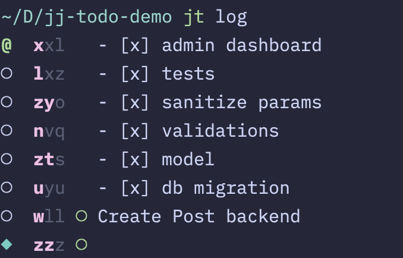

# jj-todo

A todo-list wrapper for [jj-vcs](https://github.com/jj-vcs/jj)



## Motivation

jj is a fantastic version control system which I've been happily using for some time. After using the [squash workflow](https://steveklabnik.github.io/jujutsu-tutorial/real-world-workflows/the-squash-workflow.html), I realized I could create a bunch of temporary changes after the described change and use it like a todo list, then squash them down when I was finished.

Todo lists work best when they are:

- [x] Quick to make
- [x] Granular
- [x] Give you a dopamine hit when you check an item off
- [x] Keep motivation going by letting you see your progress
- [x] Don't require context switching

jj-todo gives you some simple wrappers around `jj new`, `jj desc`, and `jj log` to make todo-lists integrated right into your usual vcs workflow, check them off as you complete them, then squash them down when you finish all the items.

## Installation

This is just a bash script. Download `jt` and `chmod +x`. It is simply a wrapper for `jj` commands with a halfway decent cli.

## Workflow

This readme will describe the commands, but I've written a [guide](docs/guide.md) for how I use this! Take a skim through the docs below so you know what the commands do, then head over to the guide. 

## Documentation

### `jt new` or `jt n`

Makes a change with the provided description preceeded by `"- [ ] "`

If the current jj change has a description, creates a new change after the current one.

If the current jj change has no description, sets the description to the message you provide.

#### Examples:

```shell
$ jt new do the things
# if the current change has a description,
# equivalent to jj new -m "- [ ] do the things"

$ jt new do the things
# if the current change has NO description,
# equivalent to jj describe -m "- [ ] do the things"
```

Quickly blast out a todo list:

```shell
$ jt n fix the bug
$ jt n update the tests
$ jt n touch up docs
```

Insert a todo before another:

```shell
$ jj new --before xyz
$ jt n oops forgot that thing
```

### `jt toggle` or `jt t`

Toggles a todo item done by changing `"- [ ]"` to `"- [x]"` (and vice versa)

It will only alter the description if it starts with `"- [ ]"` or `"- [x]"`. All other descriptions will be unaltered/ignored.

#### Examples:

```shell
$ jt log
○  tqs ○ - [ ] fix event handler
@  rws   - [ ] ui matches mockup
○  mmy   - [x] update validations

$ jt toggle
$ jt log
○  tqs ○ - [ ] fix event handler
@  rws   - [x] ui matches mockup   # <-- Notice it checked this one
○  mmy   - [x] update validations
```

### `jt log` or `jt l`

A wrapper for `jj log` with a more streamlined template.

Any args you pass will be forwarded along to `jj log`.

#### Examples:

```shell
$ jt log
$ jt log --reversed --limit 10
```
